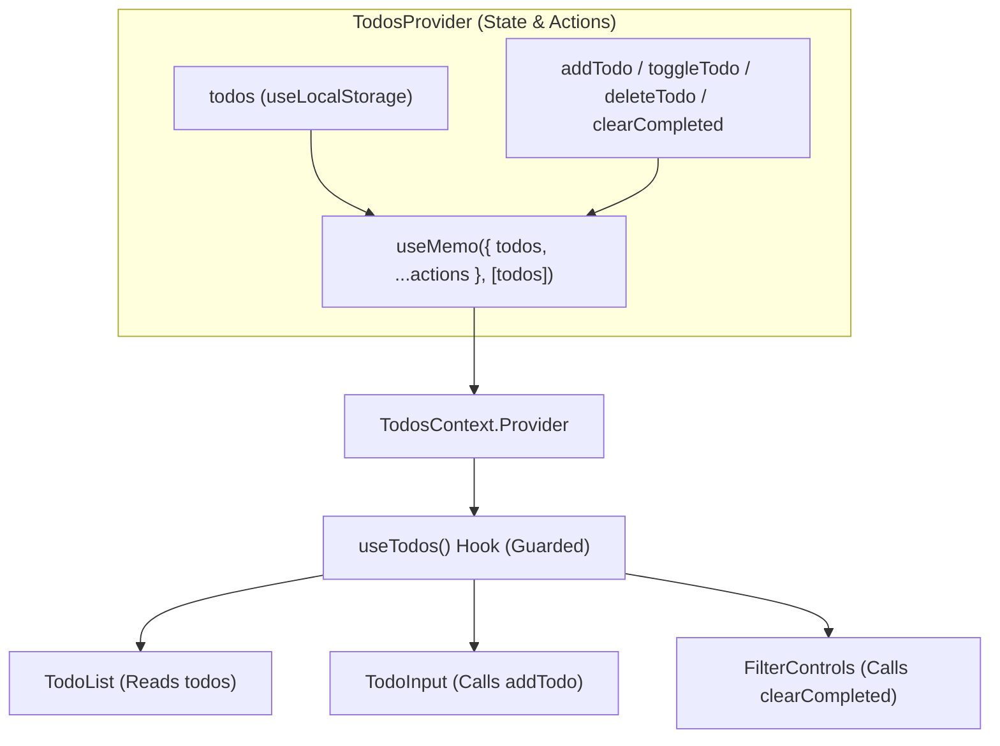

# Requirements

### Overview & Goals
Analysis and remediation plan for potential issues and anti-patterns identified in:
```typescript jsx
<TodosContext.Provider value={{todos, setTodos}}>
```
located in `src/context/TodosContext.tsx`.

The goal is to identify all TypeScript type safety issues, React performance bottlenecks, consumer safety vulnerabilities, and architectural anti-patterns, followed by a concrete plan to resolve them.

### Scope
- **In Scope**:
  - Identifying type mismatch between `createContext` definition and `TodosContext.Provider` value.
  - Analyzing re-render performance implications caused by inline object literals without `useMemo`.
  - Addressing missing context guards and unsafe default values.
  - Analyzing raw setter exposure vs. encapsulated domain action dispatchers.
  - Addressing component disconnect where `App.tsx` duplicates local state rather than consuming `TodosContext`.
- **Out of Scope**:
  - Replacing React Context with external state management libraries (e.g. Redux, Zustand) unless requested.
  - Rewriting unrelated styles or layout components.

### Problem Summary Matrix
| Category | Issue Description | Impact |
| :--- | :--- | :--- |
| **Type Safety** | Context type `{ todos: TodoProps[] }` omits `setTodos` | Consumers cannot access `setTodos` with TypeScript safety |
| **Performance** | Inline object literal `value={{todos, setTodos}}` | Unnecessary re-renders on every provider render |
| **Safety / DX** | Default fallback `{todos: []}` lacks `setTodos` / guard | Silent failures or runtime errors if used outside provider |
| **Architecture** | Exposing raw `setTodos` without domain actions | Inconsistent mutation logic scattered across components |
| **State Duplication** | `App.tsx` uses separate `useState` instead of context | Context state is orphaned and unused by UI |

# Technical Design

### Current Implementation
In `src/context/TodosContext.tsx`:
```typescript jsx
export const TodosContext = createContext<{ todos: TodoProps[] }>({todos: []})

export default function TodosProvider({children}: TodosProviderProps) {
	const [todos, setTodos] = useLocalStorage<TodoProps[]>('todos', initialTodos)
	
	return (
		<TodosContext.Provider value={{todos, setTodos}}>
			{children}
		</TodosContext.Provider>
	)
}
```

### Key Problems Identified

#### 1. TypeScript Type Mismatch & Missing `setTodos` in Context Contract
- **Problem**: `createContext<{ todos: TodoProps[] }>` defines a type containing only `todos`. Passing `value={{todos, setTodos}}` violates the intended interface contract.
- **Consequence**: When consuming `const { todos, setTodos } = useContext(TodosContext)`, TypeScript will throw a compilation error stating that `setTodos` does not exist on type `{ todos: TodoProps[] }`.

#### 2. Performance Degradation: New Object Reference on Every Render
- **Problem**: `value={{todos, setTodos}}` constructs a brand new object literal `{ todos, setTodos }` on every render cycle of `TodosProvider`.
- **Consequence**: Even when `todos` has not changed (e.g. if the provider's parent re-renders or additional state is added to the provider), all components consuming `TodosContext` are forced to re-render because `Object.is(previousValue, nextValue)` returns `false`.

#### 3. Unsafe Default Value & Lack of Provider Guard
- **Problem**: The default context value is `{todos: []}`. If a component uses `useContext(TodosContext)` outside of `<TodosProvider>`, calling `setTodos` will fail or throw `setTodos is not a function`.
- **Solution**: Set default context to `null` and export a custom `useTodos()` hook that checks `if (!context) throw new Error('useTodos must be used within a TodosProvider')`.

#### 4. Exposing Raw Dispatcher Instead of Domain Actions
- **Problem**: Passing raw `setTodos` directly exposes low-level state mutations to every UI component.
- **Consequence**: Logic for creating new IDs, toggling items, filtering, or clearing completed todos becomes duplicated or fragmented across different components.
- **Solution**: Encapsulate action handlers (`addTodo`, `toggleTodo`, `deleteTodo`, `clearCompleted`) within the provider or hook.

#### 5. Co-location of State and Dispatch (Write-only re-renders)
- **Problem**: Components that only need to trigger actions (like an `AddTodoInput` or `ClearButton`) subscribe to the same context as components displaying `todos`.
- **Consequence**: Action-only components re-render whenever the `todos` list changes.
- **Solution**: Memoize the context value or separate `TodosStateContext` and `TodosDispatchContext` if list updates are frequent.

---

### Architecture Diagram



---

### Proposed Refactoring

#### Updated `src/lib/definitions.ts`
```typescript
import type { Dispatch, SetStateAction, ReactNode } from 'react'

export interface TodoProps {
  id: number
  text: string
  done: boolean
}

export interface TodosContextType {
  todos: TodoProps[]
  setTodos: Dispatch<SetStateAction<TodoProps[]>>
  addTodo: (text: string) => void
  toggleTodo: (id: number) => void
  deleteTodo: (id: number) => void
  clearCompleted: () => void
}

export interface TodosProviderProps {
  children: ReactNode
}
```

#### Updated `src/context/TodosContext.tsx`
```typescript jsx
import { createContext, useContext, useMemo, useCallback } from 'react'
import type { TodoProps, TodosContextType, TodosProviderProps } from '../lib/definitions.ts'
import { initialTodos } from '../lib/data.ts'
import { useLocalStorage } from '../hook/useLocalStorage.tsx'

export const TodosContext = createContext<TodosContextType | null>(null)

export default function TodosProvider({ children }: TodosProviderProps) {
  const [todos, setTodos] = useLocalStorage<TodoProps[]>('todos', initialTodos)

  const addTodo = useCallback((text: string) => {
    const nextId = todos.length > 0 ? Math.max(...todos.map(t => t.id)) + 1 : 1
    setTodos(prev => [...prev, { id: nextId, text, done: false }])
  }, [todos, setTodos])

  const toggleTodo = useCallback((id: number) => {
    setTodos(prev => prev.map(t => t.id === id ? { ...t, done: !t.done } : t))
  }, [setTodos])

  const deleteTodo = useCallback((id: number) => {
    setTodos(prev => prev.filter(t => t.id !== id))
  }, [setTodos])

  const clearCompleted = useCallback(() => {
    setTodos(prev => prev.filter(t => !t.done))
  }, [setTodos])

  const value = useMemo<TodosContextType>(() => ({
    todos,
    setTodos,
    addTodo,
    toggleTodo,
    deleteTodo,
    clearCompleted
  }), [todos, setTodos, addTodo, toggleTodo, deleteTodo, clearCompleted])

  return (
    <TodosContext.Provider value={value}>
      {children}
    </TodosContext.Provider>
  )
}

export function useTodos(): TodosContextType {
  const context = useContext(TodosContext)
  if (!context) {
    throw new Error('useTodos must be used within a TodosProvider')
  }
  return context
}
```

# Testing

### Validation Approach
Verify that the identified issues are resolved and that type safety, performance memoization, and runtime safety constraints are satisfied.

### Key Scenarios
- **Type Safety Verification**:
  - Ensure consuming components (`useTodos()`) receive full TypeScript type definitions without type errors or missing property warnings.
- **Context Guard Verification**:
  - Test calling `useTodos()` outside of `<TodosProvider>` to confirm an informative descriptive error is thrown rather than a silent undefined access.
- **Reference Stability & Memoization**:
  - Confirm that re-rendering `TodosProvider` with unchanged state maintains stable context object reference and does not cause spurious consumer re-renders.
- **Integration with Application UI**:
  - Verify `App.tsx` correctly synchronizes with `TodosProvider` and persists updates to `localStorage`.

### Edge Cases
- Empty todos list ID calculation (handling empty array in `addTodo`).
- Corrupted `localStorage` data handling through `useLocalStorage`.
- Concurrent or rapid state updates using functional setState updater forms (`prev => ...`).

# Delivery Steps

### ✓ Step 1: Fix Context Type Definition and Default Value
Define the TypeScript interface for `TodosContext` to include both `todos` and `setTodos` (and helper action handlers), resolving type mismatches between the context definition and the provider value.

- Create `TodosContextType` interface in `src/lib/definitions.ts` or `src/context/TodosContext.tsx` with `todos: TodoProps[]` and state updater/action signatures.
- Update `createContext<TodosContextType | null>(null)` with proper typing instead of incomplete fallback object `{todos: []}`.

### ✓ Step 2: Memoize Context Value and Implement useTodos Hook
Optimize context performance and add consumer error handling.

- Wrap the provider value in `useMemo(() => ({ todos, setTodos }), [todos, setTodos])` to prevent unnecessary consumer re-renders caused by new object references on every render.
- Implement and export a custom `useTodos()` hook that asserts context existence and throws a descriptive error if used outside `TodosProvider`.

### ✓ Step 3: Encapsulate Domain Actions and Connect Application Components
Encapsulate business logic into helper actions and connect the context to UI components across the application.

- Add reusable action helpers (`addTodo`, `toggleTodo`, `deleteTodo`, `clearCompleted`) in `TodosProvider` to avoid exposing raw dispatchers without validation.
- Refactor `src/App.tsx`, `src/components/Todo.tsx`, and `src/components/Filter.tsx` to consume `useTodos()` instead of relying on isolated local state.